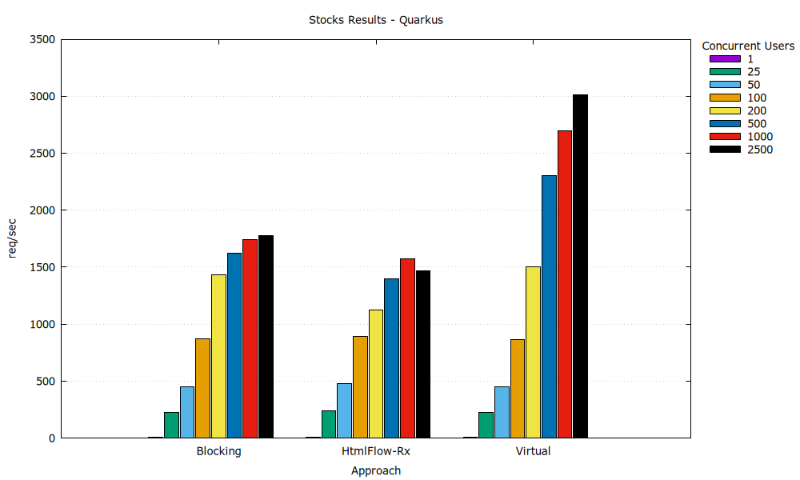

# Comparing Template Engines for Quarkus, Spring MVC, and Spring WebFlux

This project extends [Comparing Template engines for Spring Webflux](https://github.com/xmlet/spring-webflux-comparing-template-engines) and the original [_Comparing Template engines for Spring Web MVC_](https://github.com/jreijn/spring-comparing-template-engines) by [Jeroen Reijn](https://github.com/jreijn), which accompanied the presentation ["Shoot-out! Template engines for the JVM"](https://www.slideshare.net/slideshow/comparing-templateenginesjvm/27994062). It benchmarks several Java template engines across three frameworks: **Quarkus**, **Spring MVC**, and **Spring WebFlux**. The focus is on **Progressive Server-Side Rendering (PSSR)** and the ability of template engines to 
scale with increasing server load.

Template engines used in this project are:

* [Thymeleaf](http://www.thymeleaf.org/) - 3.1.3
* [HtmlFlow](https://github.com/xmlet/HtmlFlow/) - 4.7
* [kotlinx.html](https://github.com/Kotlin/kotlinx.html) - 0.12.0
* [Rocker](https://github.com/fizzed/rocker) - 2.2.1
* [JStachio](https://github.com/jstachio/jstachio) - 1.3.7
* [Pebble](https://pebbletemplates.io/) - 3.2.4
* [Freemarker](https://freemarker.apache.org/index.html) - 2.3.34
* [Trimou](https://github.com/trimou/trimou) - 2.5.1.Final
* [Velocity](https://velocity.apache.org/) - 2.3


Some relevant differences from the previous benchmark:
- The project now includes **Quarkus** and **Spring MVC** frameworks, in addition to **Spring WebFlux**.
- The benchmarks now include Virtual Thread approaches, allowing for non-blocking rendering in traditionally blocking template engines.
- In **Spring WebFlux**, the dispatcher used for the blocking routes was changed from `Dispatchers.Default` to `Dispatchers.IO`, with `limittedParallelism` set to `INT_MAX_VALUE`, to allow for testing the 
overhead of using platform threads for blocking operations when compared to virtual threads or non-blocking operations.
- Blocking routes use the `blockingIterable()` method from the `Observable` class to allow for progressive rendering in 
template engines that do not directly support asynchronous data models like Thymeleaf and HtmlFlow.

## Progressive rendering

- **Spring Webflux**: Supported, via the use of `Flux<String>` as the return type of each method.

- **Spring MVC**: Not supported, StreamingResponseBody allows for progressive rendering, but the output buffer reach capacity
before the response starts being streamed to the client. We could not find a way to configure the output buffer size.

- **Quarkus**: Supported, via the use of `Multi<String>` as the return type of reactive methods, and StreamingOutput for synchronous methods. 
similar to Spring MVC, the output buffer reaches capacity before the response starts being streamed to the client, however
Quarkus allows for configuring the output buffer size, through the `quarkus.rest.output-buffer-size=512` property in the `application.properties` file.

## Routes

The following routes are available for each framework:

### **Spring WebFlux**

#### **Presentations**
- `/presentations/thymeleaf` - asynchronous using `ReactiveDataDriverContextVariable`
- `/presentations/thymeleaf/sync` - blocking
- `/presentations/thymeleaf/virtualSync` - virtual thread
- `/presentations/htmlFlow` - asynchronous, using a callback to resume execution
- `/presentations/htmlFlow/suspending` - asynchronous, using Kotlin suspending functions
- `/presentations/htmlFlow/sync` - blocking
- `/presentations/htmlFlow/virtualSync` - virtual thread
- `/presentations/kotlinx` - asynchronous (malformed HTML)
- `/presentations/kotlinx/sync` - blocking
- `/presentations/kotlinx/virtualSync` - virtual thread
- `/presentations/rocker/sync` - blocking
- `/presentations/rocker/virtualSync` - virtual thread
- `/presentations/jstachio/sync` - blocking
- `/presentations/jstachio/virtualSync` - virtual thread
- `/presentations/pebble/sync` - blocking
- `/presentations/pebble/virtualSync` - virtual thread
- `/presentations/freemarker/sync` - blocking
- `/presentations/freemarker/virtualSync` - virtual thread
- `/presentations/trimou/sync` - blocking
- `/presentations/trimou/virtualSync` - virtual thread
- `/presentations/velocity/sync` - blocking
- `/presentations/velocity/virtualSync` - virtual thread

#### **Stocks**
- `/stocks/thymeleaf` - asynchronous using `ReactiveDataDriverContextVariable`
- `/stocks/thymeleaf/sync` - blocking
- `/stocks/thymeleaf/virtualSync` - virtual thread
- `/stocks/htmlFlow` - asynchronous, using a callback to resume execution
- `/stocks/htmlFlow/suspending` - asynchronous, using Kotlin suspending functions
- `/stocks/htmlFlow/sync` - blocking
- `/stocks/htmlFlow/virtualSync` - virtual thread
- `/stocks/kotlinx` - asynchronous (malformed HTML)
- `/stocks/kotlinx/sync` - blocking
- `/stocks/kotlinx/virtualSync` - virtual thread
- `/stocks/rocker/sync` - blocking
- `/stocks/rocker/virtualSync` - virtual thread
- `/stocks/jstachio/sync` - blocking
- `/stocks/jstachio/virtualSync` - virtual thread
- `/stocks/pebble/sync` - blocking
- `/stocks/pebble/virtualSync` - virtual thread
- `/stocks/freemarker/sync` - blocking
- `/stocks/freemarker/virtualSync` - virtual thread
- `/stocks/trimou/sync` - blocking
- `/stocks/trimou/virtualSync` - virtual thread
- `/stocks/velocity/sync` - blocking
- `/stocks/velocity/virtualSync` - virtual thread

---

### **Spring MVC**

#### **Presentations**
- `/presentations/thymeleaf` - blocking
- `/presentations/htmlFlow` - blocking
- `/presentations/kotlinx` - blocking
- `/presentations/rocker` - blocking
- `/presentations/jstachio` - blocking
- `/presentations/pebble` - blocking
- `/presentations/freemarker` - blocking
- `/presentations/trimou` - blocking
- `/presentations/velocity` - blocking

#### **Stocks**
- `/stocks/thymeleaf` - blocking
- `/stocks/htmlFlow` - blocking
- `/stocks/kotlinx` - blocking
- `/stocks/rocker` - blocking
- `/stocks/jstachio` - blocking
- `/stocks/pebble` - blocking
- `/stocks/freemarker` - blocking
- `/stocks/trimou` - blocking
- `/stocks/velocity` - blocking

---

### **Quarkus**

#### **Presentations**
- `/presentations/thymeleaf` - blocking
- `/presentations/htmlFlow` - blocking
- `/presentations/kotlinx` - blocking
- `/presentations/rocker` - blocking
- `/presentations/jstachio` - blocking
- `/presentations/pebble` - blocking
- `/presentations/freemarker` - blocking
- `/presentations/trimou` - blocking
- `/presentations/velocity` - blocking
- `/presentations/reactive/htmlFlow` - reactive

#### **Stocks**
- `/stocks/thymeleaf` - blocking
- `/stocks/htmlFlow` - blocking
- `/stocks/kotlinx` - blocking
- `/stocks/rocker` - blocking
- `/stocks/jstachio` - blocking
- `/stocks/pebble` - blocking
- `/stocks/freemarker` - blocking
- `/stocks/trimou` - blocking
- `/stocks/velocity` - blocking
- `/stocks/reactive/htmlFlow` - reactive

## Build and Run

### Prerequisites
- **Java 21**
- **Gradle 7+**

### Build the Project
Run the following command to build the project:

```bash
./gradlew build
```

### Run the Project
To run the project for a specific framework, use the following commands:

- **Spring WebFlux**:
```bash
java -jar pssr-benchmark-spring-webflux/build/libs/pssr-benchmark-spring-webflux-1.0-SNAPSHOT.jar
```
or if you want to run it with Gradle:
```bash
  ./gradlew runWebflux
```

- **Spring MVC**:
```bash
java -jar pssr-benchmark-spring-mvc/build/libs/pssr-benchmark-spring-mvc-1.0-SNAPSHOT.jar
```
or if you want to run it with Gradle:
```bash
    ./gradlew runMVC
```
and with virtual threads:
```bash
    ./gradlew runMVCVirtual
```
  
- **Quarkus**:
```bash
java -jar pssr-benchmark-quarkus/build/quarkus-app/quarkus-run.jar
```
or if you want to run it with Gradle:
```bash
    ./gradlew runQuarkus
```
and with virtual threads:
```bash
    ./gradlew runQuarkusVirtual
```

## Running Benchmarks

### Apache Benchmark (ab)

Run the benchmarks with:

```bash
cd benches/ab
./bench-webflux.sh
./bench-mvc.sh
./bench-quarkus.sh
```

### JMeter

```bash
cd benches/jmeter
./bench-webflux.sh
./bench-mvc.sh
./bench-quarkus.sh
```

### JMH

Run the JMH benchmarks with:

```bash
cd benches/jmh
./bench-jmh.sh
```

## Results

This section shows the performance and scalability results of the benchmarks conducted for each framework and template engine. All
tests were conducted on a Github-hosted virtual machine under GitHub Actions, running Ubuntu 22.04 with 4 cores and 16GB of RAM. 
The JVM used was OpenJDK 21.

### Performance Results

The performance results show the throughput (number of renders per second) for each template engine. The goal 
is to measure how well each engine performs in template rendering.


### Scalability Results

The scalability results depict the throughput (number of requests per second) for each template engine,
with concurrent requests ranging from 1 to 2500 users. The goal is to observe how well each engine/approach scales with increasing 
server load. To simulate I/O operations and enable progressive rendering, we interleaved `Observable<T>` elements with 
a 5-millisecond delay in each route.

#### **Spring WebFlux**

In Spring WebFlux, we highlight HtmlFlow using suspendable web templates (`HtmlFlow-Susp`), `Thymeleaf-Rx` with `ReactiveDataDriverContextVariable`, and `Jstachio-Virtual`, blocking with virtual threads.
Aditionally, `Blocking` and `Virtual` are the aggregated results for all blocking and virtual thread routes, respectively.


#### **Spring MVC**

In Spring MVC, we highlight `Blocking` and `Virtual`, which are the aggregated results for all blocking and virtual thread routes, respectively.


#### **Quarkus**

In Quarkus, we highlight `Blocking` and `Virtual`, as well as HtmlFlow using a reactive approach (`HtmlFlow-Rx`).


