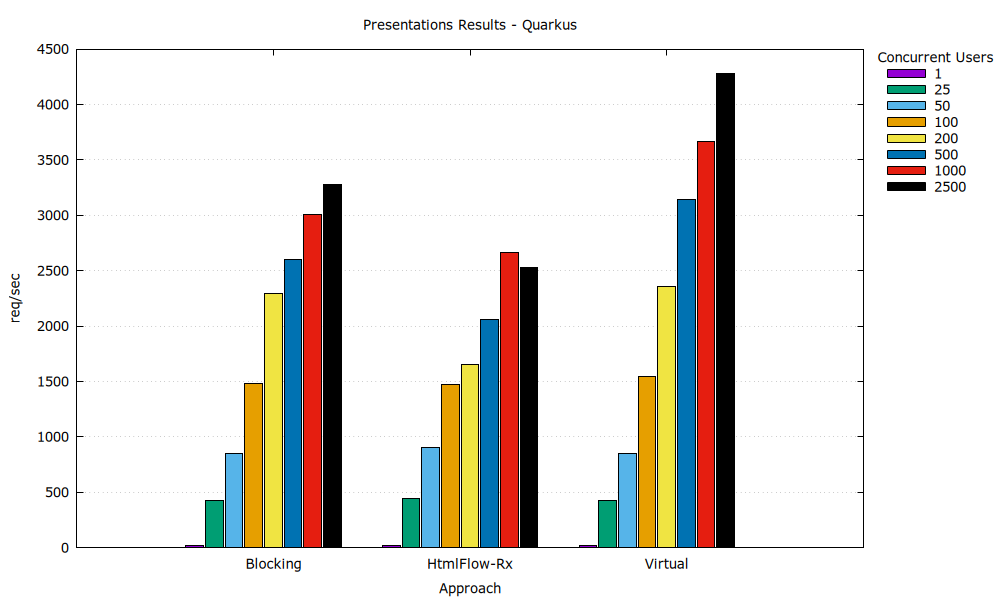

# Comparing Template Engines for Quarkus, Spring MVC, and Spring WebFlux

This project builds upon previous work comparing Java template engines for [Spring WebFlux](https://github.com/xmlet/spring-webflux-comparing-template-engines) and [Spring MVC](https://github.com/jreijn/spring-comparing-template-engines), originally presented in ["Shoot-out! Template engines for the JVM"](https://www.slideshare.net/slideshow/comparing-templateenginesjvm/27994062) by [Jeroen Reijn](https://github.com/jreijn).

We benchmark multiple Java template engines across three frameworks — **Quarkus**, **Spring MVC**, and **Spring WebFlux** — focusing on **Progressive Server-Side Rendering (PSSR)**, scalability under load, and modern Java features like **virtual threads**.

---

## 🔧 Template Engines

The following engines are included in the benchmark:

| Engine                                                 | Version     |
|--------------------------------------------------------|-------------|
| [Thymeleaf](https://www.thymeleaf.org/)                | 3.1.3       |
| [HtmlFlow](https://htmlflow.org/)                      | 4.7         |
| [kotlinx.html](https://github.com/Kotlin/kotlinx.html) | 0.12.0      |
| [Rocker](https://github.com/fizzed/rocker)             | 2.2.1       |
| [JStachio](https://jstach.io/jstachio/)                | 1.3.7       |
| [Pebble](https://pebbletemplates.io/)                  | 3.2.4       |
| [Freemarker](https://freemarker.apache.org/)           | 2.3.34      |
| [Trimou](https://github.com/trimou/trimou)             | 2.5.1.Final |
| [Velocity](https://velocity.apache.org/)               | 2.3         |

---

## Changes from Previous Work

- Added **Quarkus** and **Spring MVC** support, alongside Spring WebFlux.
- Integrated **virtual threads**, enabling non-blocking behavior in traditionally blocking engines.
- Replaced `Dispatchers.Default` with `Dispatchers.IO` (unlimited parallelism) in Spring WebFlux to measure blocking overhead.
- Enabled **progressive rendering** for engines without asynchronous data model support using `Observable.blockingIterable()`.

---

## Progressive Rendering Support

| Framework          | Supported    | Notes                                                                                                                                                    |
|--------------------|--------------|----------------------------------------------------------------------------------------------------------------------------------------------------------|
| **Spring WebFlux** | ✅            | Uses `Flux<String>` and reactive adapters.                                                                                                               |
| **Spring MVC**     | ⚠️ Partially | `StreamingResponseBody` supported, but early buffering prevents complete streaming.                                                                      |
| **Quarkus**        | ✅            | Uses `Multi<String>` for reactive routes and StreamingOutput with configurable output buffer (`quarkus.rest.output-buffer-size`) for synchronous routes. |

---

## Available Routes

Each framework exposes routes under `/presentations` and `/stocks`, rendered by different engines and threading models.

<details>
<summary><strong> Spring WebFlux Routes</strong></summary>

- **Thymeleaf**: async, sync, virtual
- **HtmlFlow**: async (callback), suspending, sync, virtual
- **kotlinx.html**: async (malformed), sync, virtual
- **Rocker, JStachio, Pebble, Freemarker, Trimou, Velocity**: sync, virtual

</details>

<details>
<summary><strong> Spring MVC Routes</strong></summary>

All routes are **blocking**, with optional support for **virtual threads**:

- Engines: Thymeleaf, HtmlFlow, kotlinx.html, Rocker, JStachio, Pebble, Freemarker, Trimou, Velocity

</details>

<details>
<summary><strong> Quarkus Routes</strong></summary>

All engines support **blocking**, and HtmlFlow also supports **reactive** mode:

- `/presentations/reactive/htmlFlow`
- `/stocks/reactive/htmlFlow`

</details>

---

## 🛠 Build & Run

### Prerequisites

- **Java 21**
- **Gradle 7+**

### Build All Modules

```bash
./gradlew build
```

### Run by Framework

#### Spring WebFlux

```bash
# JAR
java -jar pssr-benchmark-spring-webflux/build/libs/pssr-benchmark-spring-webflux-1.0-SNAPSHOT.jar

# Gradle
./gradlew runWebflux
```

#### Spring MVC

```bash
# JAR
java -jar pssr-benchmark-spring-mvc/build/libs/pssr-benchmark-spring-mvc-1.0-SNAPSHOT.jar

# Gradle
./gradlew runMVC           # Traditional threads
./gradlew runMVCVirtual    # Virtual threads
```

#### Quarkus

```bash
# JAR
java -jar pssr-benchmark-quarkus/build/quarkus-app/quarkus-run.jar

# Gradle
./gradlew runQuarkus        # Traditional threads
./gradlew runQuarkusVirtual # Virtual threads
```

---

## 📊 Running Benchmarks

### Apache Benchmark (ab)

```bash
cd benches/ab
./bench-webflux.sh
./bench-mvc.sh
./bench-quarkus.sh
```

### JMeter

```bash
cd benches/jmeter
./bench-webflux.sh
./bench-mvc.sh
./bench-quarkus.sh
```

### JMH (Java Microbenchmark Harness)

```bash
cd benches/jmh
./bench-jmh.sh
```

---

## Benchmark Results

All tests were run on a GitHub-hosted Ubuntu 22.04 VM with **4 cores**, **16GB RAM**, and **OpenJDK 21**.

### Performance (JMH)

The performance results show the throughput (number of renders per second) for each template engine. The goal
is to measure how well each engine performs in template rendering.

| Presentations                                                      | Stocks                                               |
|--------------------------------------------------------------------|------------------------------------------------------|
|  |  |

---

### Scalability

The scalability results depict the throughput (number of requests per second) for each template engine,
with concurrent requests ranging from 1 to 2500 users. The goal is to observe how well each engine/approach scales with increasing
server load. To simulate I/O operations and enable progressive rendering, we interleaved `Observable<T>` elements with
a 5-millisecond delay in each route.

#### Spring WebFlux Highlights

- `HtmlFlow-Susp` (suspendable templates)
- `Thymeleaf-Rx` (reactive)
- `Jstachio-Virtual` (virtual threads)
- Aggregated: `Blocking`, `Virtual`

| Presentations                                                  | Stocks                                           |
|----------------------------------------------------------------|--------------------------------------------------|
|  |  |

#### Spring MVC Highlights

- Aggregated: `Blocking`, `Virtual`

| Presentations                                          | Stocks                                   |
|--------------------------------------------------------|------------------------------------------|
|  |  |

#### Quarkus Highlights

- `HtmlFlow-Rx` (reactive)
- Aggregated: `Blocking`, `Virtual`

| Presentations                                                  | Stocks                                           |
|----------------------------------------------------------------|--------------------------------------------------|
|  |  |
